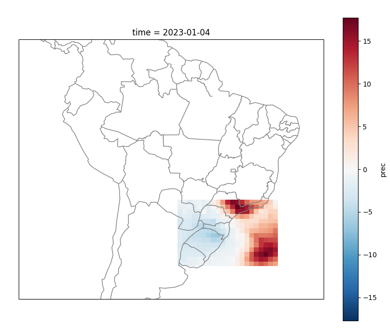
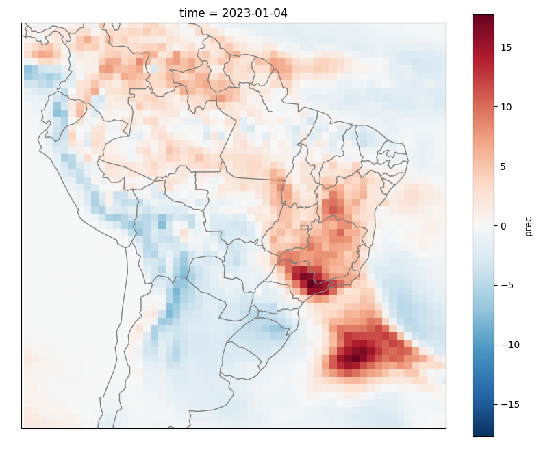

Exemplos Python
===============

.. warning::
   Alterar para os valores exibidos na inicialização.

   Inicialização comando:
   sub = SUB.model()

  
.. note::
  #### The Brazilian Global Atmospheric Model (TQ0666L064 / Hybrid) #####

--------------------
Forecast data available for reading.

2024-01-01 - 2024-02-01 - 2024-03-01 - 2024-04-01 - 2024-05-01
2024-06-01 - 2024-07-01 - --------------------
Variables: ['prec', 'prec_ca', 't2mt', 't2mt_ca', 'psnm', 'role', 'tp85', 'zg50', 'uv85', 'uv20', 'vv85', 'vv20', 'cr85', 'cr20']
--------------------
Products: ['seas', 'mnth']
--------------------
Field: ['anomalies', 'prob_positve_anomaly', 'prob_terciles', 'totals']
--------------------
  

Recuperar Dados do Modelos Numérico SubSazonal
----------------------------------------------
.. code-block:: console

# Import the Library
import sazonal.CPTEC_SAZ as SAZ

# Initialize the Constructorr
saz = SAZ.model()

# Initial Condition Date
date = '20240401'

# Variable
var = ['prec']

# Time Range
product = 'seas' 

# Map Type
field = 'anomalies' 

# Data Request / Data retrieval
f = saz.load(date=date, var=var, product=product ,field=field) 

  # Retorna um Xarray
  print(f)
# <xarray.Dataset> Size: 594kB
# Dimensions:  (lat: 192, time: 2, lon: 384)
# Coordinates:
#  * lat      (lat) float64 2kB -89.28 -88.36 -87.42 -86.49 ... 87.42 88.36 89.28
#  * time     (time) datetime64[ns] 16B 2024-04-01 2024-07-01
#  * lon      (lon) float64 3kB -180.0 -179.1 -178.1 -177.2 ... 177.2 178.1 179.1
# Data variables:
#    prec     (time, lat, lon) float32 590kB 3.252 3.252 3.252 ... 1.045 1.045
# Attributes:
#    center:          National Institute for Space Research - INPE
#    model:           The Brazilian Global Atmospheric Model V1.2 (TQ0126L042 ...
#    initialization:  2024-04-01
#    field:           Forecast Anomalies
  quit()

Download :download:`get_data_sub_oper.py <examples/get_data_sub_oper.py>`.

.. _reference-name:

A cool section
""""""""""""""

.. _target:

The hyperlink target above points to this paragraph.

Recuperar Dados e Salvar em NetCDF
-------------------------------

.. code-block:: console

  # Importa a ferramenta
  import subsaz.CPTEC_SUB as SUB
  
  # Inicializa o construtor
  sub = SUB.model()

  # Data Condição Inicial (IC)
  date = '20230104'

  # variavel
  var = 'prec'

  # produto
  product = 'week'

  # campo
  field = 'anomalies'

  # passo depende do produto escolhido
  step = '01'

  # Requisição dos dados
  f = sub.load(date=date, var=var, step=step, product=product ,field=field)

  # Salvar XArray em NetCDF
  f.to_netcdf('arquivo.nc')

  quit()

Download :download:`get_sub_netcdf.py <examples/get_sub_netcdf.py>`.

Recuperar Dados e Plotar Figura
-------------------------------

.. code-block:: console

  # Importa a ferramenta
  import subsaz.CPTEC_SUB as SUB
  import matplotlib.pyplot as plt

  # Inicializa o construtor
  sub = SUB.model()

  # Data Condição Inicial (IC)
  date = '20230104'

  # variavel
  var = 'prec'

  # produto
  product = 'week'

  # campo
  field = 'anomalies'

  # passo depende do produto escolhido
  step = '01'

  # Requisição dos dados
  f = sub.load(date=date, var=var, step=step, product=product ,field=field)

  # Plotar a figura com a variavel prec
  f.prec.plot()
  plt.show()

  quit()

Download :download:`plot_sub_figure.py <examples/plot_sub_figure.py>`.

Recuperar Dados com recorte de área
-----------------------------------

.. code-block:: console

   pip install cartopy

.. code-block:: console

   import subsaz.CPTEC_SUB as SUB
   import matplotlib.pyplot as plt
   import cartopy.crs as ccrs
   import cartopy.feature as cfeature

   # Inicializa o construtor
   sub = SUB.model()
   # Filtrar area definida
   sub.dict['area']['reduce'] = True 
   sub.dict['area']['minlat'] = -34.44
   sub.dict['area']['maxlat'] = -21.43
   sub.dict['area']['minlon'] = 301.14
   sub.dict['area']['maxlon'] = 320.57
   # Requisição dos dados
   f = sub.load(date='20230104', var='prec', step='01', product='week' ,field='anomalies')
   # Definir tamanho da figura
   fig = plt.figure(figsize=(10,8))
   # Setar figura unica
   ax = fig.add_subplot(111, projection=ccrs.PlateCarree())
   # Colocar  Linhas de Borda dos paises e linhas costeiras
   ax.add_feature(cfeature.COASTLINE,color='grey')
   ax.add_feature(cfeature.BORDERS,color='grey')
   # Definir Regiao do Brasil
   ax.set_extent([-90,-30,10,-41], ccrs.PlateCarree())
   # Setar estados do Brasil
   states = cfeature.NaturalEarthFeature(category='cultural',
                                            name='admin_1_states_provinces_lines',
                                            scale='50m', facecolor='none')
   # Colocar Estados Brasil
   ax.add_feature(states, edgecolor='gray')
   # Plotar variavel
   f.prec.plot()
   plt.show()

|pic1|

Download :download:`plot_sub_filter.py <examples/prec_sub_filter.py>`.

  
.. note::
   Para filtrar somente os dados do Brasil existe uma configuração padrão. Utilizar somente
   o comando: 
   **sub.dict['area']['reduce'] = True**    

|pic2|

   
